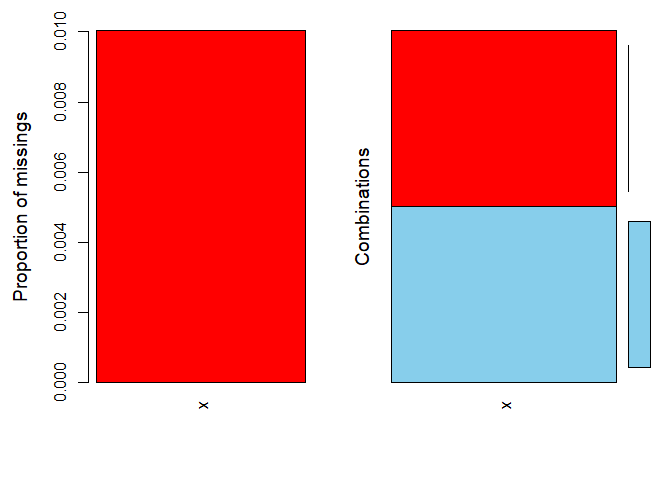
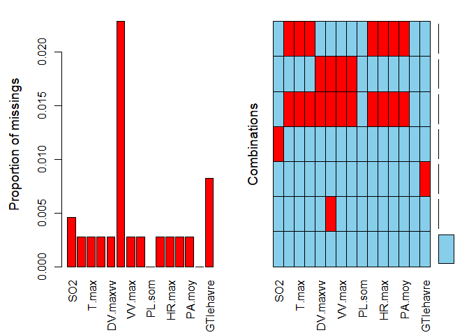

DATA SCIENCE STUDY: Prediction of PM10 pollution in the Rouen region
(France) with VSURF and Cart algorithms
================
Constant Patrice A. KODJA A./ AI Engineer & Data Scientist
2024-05-22

``` r
#library(VIM)
library(VSURF)
library(rpart)
```

------------------------------------------------------------------------

## Executive Summary

1.  Introduction

The PM10 (particles with a diameter of 10 micrometres or less): these
particles are small enough to pass through the throat and nose and enter
the lungs. Once inhaled, these particles can affect the heart and lungs
and cause serious health effects. \[Particulate matter (PM10 and
PM2.5) - NSW
Health\](<https://www.health.nsw.gov.au/environment/air/Pages/particulate-matter.aspx#>:~:text=PM10%20(particles%20with%20a%20diameter,PM2.).

Six different monitoring stations of the Rouen (Haute Normandie, France)
area are considered. For this data modelization, We are considering the
**gcm station** which is located in an industrial area. For more
details,[please check this
link](https://rdrr.io/cran/VSURF/man/PM10.html)

2.  Objective Elaborate a statistical model to predict the PM10
    pollution in Rouen area (France) in order to determine its negative
    impact on people.

3.  Methodology

The target or response variable is numerical so regression prediction
model is used. As there are missing data and to avoid suppression
observations, we will keep the actual data frame and will use Decision
Tree Algorithm which copes with NA values.

Before to use the Decision Tree, the model Variable Selection is
conducted with Random Forest function **VSURF**-Variable Selection Using
Random Forest. This function runs three processes-Elimination,
Interpretation and Prediction,in order to reduce the number of
explanation variables (16 in total) to the minimum possible number to
run the final decision tree model and get accurate result.

The Decision Tree algorithm (**rpart**) will use the selected
explanatory variables to provide the final model.

As both Interpretation and Prediction steps provide selected explonatory
variables. The two sets of variables will be used separately with Cart
algorithm -Decision Tree to provide Two final models which will be
compared to each other via the Cross-Validation Error testing in order
to choose the best one with the minimum error value.

In order to get accurate models, the data will be shared in Training and
Test Data. Both models will be trained on the same Training Data and the
prediction will be run on the Test Data

**Data Information:**

- Data source:F.-X. Jollois, J.-M. Poggi, B. Portier, Three non-linear
  statistical methods to analyze PM10 pollution in Rouen area. CSBIGS
  3(1): 1-17, 2009

  - PM10: Real-world data on PM10 pollution in Rouen area, France (In
    VSURF: Variable Selection Using Random Forests)

**Variable Description:**

**Target or Response Variable:** PM10: Numerical type Daily mean
concentration of PM10, in μ $g/m^3$

**Explanatory Variables:** SO2 Daily mean concentration of SO2, in μ
g/m^3

T.min, T.max, T.moy Daily minimum, maximum and mean temperature, in
degree Celsius

DV.maxvv, DV.dom Daily maximum speed and dominant wind direction, in
degree (for wind direction, 0 degree corresponds to north)

VV.max, VV.moy Daily maximum and mean wind speed, in m/s

PL.som Daily rainfall, in mm

HR.min, HR.max, HR.moy Daily minimum, maximum and mean relative
humidity, in %

PA.moy Daily mean air pressure, in hPa

GTrouen, GTlehavre Daily temperature gradient, in degree Celsius

4.  Findings:

- Both algorithms, Random Forest and Decision Tree, run entirely on a
  data frame containing missing data without being blocked.

- Prediction step process provides less number of explanatory variables
  the interpretation step.

- Prediction model is the best with the minimum cross-validation error
  value

5.  Recommendations:

The Cart Algorithm in R is unstable so better associate it with Bagging
or Random Forest algorithm. This is why we use VSURF in this study.

If VSURF is used like here, after Threshold or Elimination step check if
Interpretation step or if Prediction step selected variables will
provide the best final model.

With Big Data with thousands of explanatory variables and depending on
the system’s operating capacity, avoid using VSURF in its entirety by
running all the three processes at the same time. Better to try the
Threshold step first for variable elimination and choose to proceed to
the Interpretation step or the prediction’s one or both.

6.  Conclusion:

VSURF combined with the Cart algorithm handles correctly data with
missing data modeling and provides good results.

Data have to be preprocessed and divided into training and test data The
Modeling process must be adapted to the capacity of the system.

Most algorithms do not support missing data but Cart and Random Forest
do and simply ignore the affected observations.

------------------------------------------------------------------------

# Variable Selection Step:

Getting Pollution data from VSURF package:

``` r
DataPol=VSURF::gcm
head(DataPol)
```

    ##   PM10 SO2 T.min T.max     T.moy DV.maxvv DV.dom VV.max   VV.moy PL.som HR.min
    ## 1    9   0  -0.6   4.4  1.173913      160  180.0      8 5.347826     11     93
    ## 2   24   2  -1.3   5.6  2.012500       20   22.5      7 4.958333      3     78
    ## 3   25   2  -4.2  -0.7 -2.933333       40  180.0      3 2.250000      0     63
    ## 4   21   2  -2.5   4.0  1.520833      200  202.5      4 2.708333      0     86
    ## 5   16   1   2.4   7.7  5.033333      200  180.0      5 3.250000      0     91
    ## 6   12   2   6.5   9.1  7.629167      210  202.5      6 4.458333      0     87
    ##   HR.max   HR.moy   PA.moy GTrouen GTlehavre
    ## 1     97 96.21739 1010.930     0.7      -0.3
    ## 2     96 87.87500 1016.975    -0.5       0.0
    ## 3     91 82.62500 1024.088     2.4       0.1
    ## 4     97 94.00000 1021.954     2.7      -0.2
    ## 5     98 96.25000 1021.562     2.4      -0.2
    ## 6     97 93.29167 1019.475     0.6      -0.3

As PM10 is quantitative response variable, we will compute regression
modelization.

## Dimension of the data frame “DataPol”

``` r
dim(DataPol)
```

    ## [1] 1096   16

Separation of the target variable from the explanatory variables

``` r
# Target variable
Ypm10 = DataPol[,1]

# Explanatory variables
Xpm10 = DataPol[,-1]
#Xpm10
#Ypm10
```

------------------------------------------------------------------------

## With NA in explanatory variables and response variable, linear modeling cannot easily be conducted as seen below:

color Red represents NA

``` r
VIM::aggr(Ypm10)
```

<!-- -->

``` r
VIM::aggr(Xpm10)
```

<!-- -->

VSURF and Cart-Decision Tree algorithms work on data presenting missing
values

## Data separation in Learning (80% of the complete data) and in test (20%) data:

``` r
#lrate=nrow(DataPol)*0.8 = 876.8 #Learning data proportion
lrate=876
learnSamp=sample(1:nrow(DataPol),lrate)
lrate  #80% of the raw data
```

    ## [1] 876

``` r
nrow(DataPol)-lrate   #Test data proportion
```

    ## [1] 220

``` r
#learnSamp
```

We will use 876 for learning samples and 220 for the test samples

``` r
LPM10datX=Xpm10[learnSamp,]; LPM10datY=Ypm10[learnSamp]
TPM10datX=Xpm10[-learnSamp,]; TPM10datY=Ypm10[-learnSamp]
```

------------------------------------------------------------------------

## The three steps of variable selection: Thresholding, interpretation and prediction are performed together here

``` r
PM10varsel <-VSURF(LPM10datY~.,data=LPM10datX, na.action=na.omit)
```

    ## Thresholding step
    ## Estimated computational time (on one core): 61.8 sec.
    ##   |                                                                              |                                                                      |   0%  |                                                                              |====                                                                  |   5%  |                                                                              |=======                                                               |  10%  |                                                                              |==========                                                            |  15%  |                                                                              |==============                                                        |  20%  |                                                                              |==================                                                    |  25%  |                                                                              |=====================                                                 |  30%  |                                                                              |========================                                              |  35%  |                                                                              |============================                                          |  40%  |                                                                              |================================                                      |  45%  |                                                                              |===================================                                   |  50%  |                                                                              |======================================                                |  55%  |                                                                              |==========================================                            |  60%  |                                                                              |==============================================                        |  65%  |                                                                              |=================================================                     |  70%  |                                                                              |====================================================                  |  75%  |                                                                              |========================================================              |  80%  |                                                                              |============================================================          |  85%  |                                                                              |===============================================================       |  90%  |                                                                              |==================================================================    |  95%  |                                                                              |======================================================================| 100%
    ## Interpretation step (on 15 variables)
    ## Estimated computational time (on one core): between 6 sec. and  66 sec.
    ##   |                                                                              |                                                                      |   0%  |                                                                              |=====                                                                 |   7%  |                                                                              |=========                                                             |  13%  |                                                                              |==============                                                        |  20%  |                                                                              |===================                                                   |  27%  |                                                                              |=======================                                               |  33%  |                                                                              |============================                                          |  40%  |                                                                              |=================================                                     |  47%  |                                                                              |=====================================                                 |  53%  |                                                                              |==========================================                            |  60%  |                                                                              |===============================================                       |  67%  |                                                                              |===================================================                   |  73%  |                                                                              |========================================================              |  80%  |                                                                              |=============================================================         |  87%  |                                                                              |=================================================================     |  93%  |                                                                              |======================================================================| 100%
    ## Prediction step (on 12 variables)
    ## Maximum estimated computational time (on one core): 45.6 sec.
    ##   |                                                                              |                                                                      |   0%  |                                                                              |======                                                                |   8%  |                                                                              |============                                                          |  17%  |                                                                              |==================                                                    |  25%  |                                                                              |=======================                                               |  33%  |                                                                              |=============================                                         |  42%  |                                                                              |===================================                                   |  50%  |                                                                              |=========================================                             |  58%  |                                                                              |===============================================                       |  67%  |                                                                              |====================================================                  |  75%  |                                                                              |==========================================================            |  83%  |                                                                              |================================================================      |  92%  |                                                                              |======================================================================| 100%

    ## Warning in VSURF.formula(LPM10datY ~ ., data = LPM10datX, na.action = na.omit): VSURF with a formula-type call outputs selected variables
    ## which are indices of the input matrix based on the formula:
    ## you may reorder these to get indices of the original data

\###Above steps interpretation:

- After the Thresholding step: 15 explanatory variables are selected
  within 16 only one is elimited then;
- After the Interpretation step: 11 explanatory variable remained from
  the 15
- After the Prediction step: 8 explanatory variable are selected within
  the 11 (For this one check below “PM10varsel\[\[3\]\]”)

------------------------------------------------------------------------

Function to treat mission value-NA is set by default to **omit** as seen
below:

``` r
PM10varsel$na.action
```

    ##  965  647   48  321  225  695  229  591  224  230  402  964  652 1006  414  870 
    ##   18   51   61   68   75  101  130  132  140  171  177  180  182  197  216  335 
    ##  277  879  686  648  349  394  876  348   59  179   33   52  243  873  232  347 
    ##  347  380  386  408  423  439  451  462  464  466  483  484  576  647  656  682 
    ##  228  242  217  170  233  341  646    8  322  575 
    ##  694  698  705  711  719  735  766  829  844  871 
    ## attr(,"class")
    ## [1] "omit"

------------------------------------------------------------------------

The different selections of VSURF step variables are displayed in the
order Threshold, Interpretation and Prediction:

``` r
PM10varsel[[1]]
```

    ##  [1]  1  4 15  8  2  3  5 14  6  9 13 12 10  7 11

``` r
PM10varsel[[2]]
```

    ##  [1]  1  4 15  8  2  3  5 14  6  9 13 12

``` r
PM10varsel[[3]]
```

    ## [1]  1  4 15  8  5 14  9 13 12

### Above results description:

A total of 8 explanatory variables The VSURF processes the prediction
step: 1 4 15 8 5 6 13 9 As said before they are 11 for Interpretation
step: 1 4 15 3 2 8 14 5 6 13 9 and 15 after the first step-Thresholding:
1 4 15 3 2 8 14 5 6 13 9 10 12 7 11

------------------------------------------------------------------------

## List of 15 first explanatory variables of the above Threshold step:

``` r
names(LPM10datX[1,1:15])
```

    ##  [1] "SO2"       "T.min"     "T.max"     "T.moy"     "DV.maxvv"  "DV.dom"   
    ##  [7] "VV.max"    "VV.moy"    "PL.som"    "HR.min"    "HR.max"    "HR.moy"   
    ## [13] "PA.moy"    "GTrouen"   "GTlehavre"

## Renaming of explanatory variables to avoid using numbers as variable names

``` r
colnames(LPM10datX)<- c("V1","V2","V3","V4","V5","V6","V7","V8","V8","V9","V10","V12","V13","V14","V15")
head(LPM10datX)
```

    ##     V1   V2   V3        V4  V5    V6 V7       V8 V8 V9 V10      V12      V13
    ## 605  1 10.9 21.0 15.966667 150  67.5  4 2.250000  0 47  97 73.95833 1018.854
    ## 185  1 11.1 18.3 14.508333 250 270.0  7 5.083333  1 50  92 72.12500 1017.567
    ## 144  3  4.2 14.5 10.175000  70  22.5  7 3.958333  0 51  91 68.41667 1028.646
    ## 570  3 13.2 20.2 16.695833 300 270.0  3 1.583333  0 67  98 84.83333 1010.729
    ## 316  3  1.0  9.4  6.895833  30  22.5  8 4.916667  0 68  95 86.12500 1020.683
    ## 5    1  2.4  7.7  5.033333 200 180.0  5 3.250000  0 91  98 96.25000 1021.562
    ##     V14  V15
    ## 605 4.1  0.8
    ## 185 0.7 -0.5
    ## 144 0.9  0.6
    ## 570 0.4  0.0
    ## 316 0.5 -0.2
    ## 5   2.4 -0.2

------------------------------------------------------------------------

# Modelling steps

## Step1: Interpretation model computation based on the above interpretation step result:

VSURF Interpretation selected variable: 1 4 15 3 2 8 14 5 6 13 9.
Decision Tree Cart algo is run with them

``` r
PM10RegTree1 <- rpart(LPM10datY~V1+V4+V15+V3+V2+V8+V14+V5+V6+V13+V9,data=LPM10datX,minsplit=2,cp=10^(-9))
```

## The maximal Tree for interpretation step

``` r
#PM10RegTree1
```

The above **rpart()** result displayed “n=865 for Root split out of 876
observations so 11 observations were deleted due to missingness” as we
don’t know deleted individuals we cannot compute the **empirical risk**
in order to check if the model Tree is maximal or not.

For learning data target column PM10 we have 876 and for the
**predict()** we get 865 as 11 were deleted

So below is not possible to compute the empirical risk or learning
error. We will suppose that with the CP=10^(-9) we have the maximal tree
and compute the pruning process in order to get final tree.

``` r
length(LPM10datY)
```

    ## [1] 876

``` r
PM10pred1 = predict(PM10RegTree1)
length(PM10pred1)
```

    ## [1] 867

``` r
#PM10learnError= 1/nrow(LPM10datX)*sum((PM10pred1-LPM10datY)^2)
#PM10learnError
```

### Final Tree computation function for the interpretation step

``` r
finalCart=function(T)
{
  P=printcp(T)
  CV=P[,4]
  a=which(CV==min(CV))
  s=P[a,4]+P[a,5]
  ss=min(s)
  b=which(CV<=ss)
  d=b[1]
  Tfinal=prune(T,cp=P[d,1])
  finalCart=Tfinal
}
```

### Function using prune() to get Final Tree (“Best” Tree from the Maximal Tree TreeClass1) for the interpretation step

``` r
PM10Trf1=finalCart(PM10RegTree1)
```

    ## 
    ## Regression tree:
    ## rpart(formula = LPM10datY ~ V1 + V4 + V15 + V3 + V2 + V8 + V14 + 
    ##     V5 + V6 + V13 + V9, data = LPM10datX, minsplit = 2, cp = 10^(-9))
    ## 
    ## Variables actually used in tree construction:
    ##  [1] V1  V13 V14 V15 V2  V3  V4  V5  V6  V8  V9 
    ## 
    ## Root node error: 65637/867 = 75.706
    ## 
    ## n=867 (9 observations effacées parce que manquantes)
    ## 
    ##             CP nsplit  rel error  xerror     xstd
    ## 1   1.6613e-01      0 1.00000000 1.00183 0.092248
    ## 2   7.9316e-02      1 0.83386595 0.84065 0.080453
    ## 3   6.4545e-02      2 0.75455006 0.77277 0.080139
    ## 4   3.8652e-02      3 0.69000458 0.77113 0.080140
    ## 5   2.2980e-02      4 0.65135279 0.78507 0.075921
    ## 6   2.1338e-02      5 0.62837319 0.77907 0.075930
    ## 7   2.0584e-02      6 0.60703484 0.78317 0.076107
    ## 8   1.7758e-02      7 0.58645036 0.77014 0.074913
    ## 9   1.4816e-02      9 0.55093436 0.74728 0.067170
    ## 10  1.4523e-02     10 0.53611885 0.73863 0.066958
    ## 11  1.2468e-02     11 0.52159618 0.73364 0.067092
    ## 12  1.1002e-02     12 0.50912794 0.74598 0.067554
    ## 13  9.6637e-03     13 0.49812562 0.74202 0.067193
    ## 14  8.3486e-03     14 0.48846195 0.74861 0.067652
    ## 15  8.2270e-03     16 0.47176471 0.75401 0.067769
    ## 16  7.9404e-03     17 0.46353770 0.75818 0.067951
    ## 17  7.8734e-03     18 0.45559727 0.76181 0.068049
    ## 18  7.8222e-03     19 0.44772388 0.76353 0.068089
    ## 19  7.5297e-03     20 0.43990164 0.77028 0.068590
    ## 20  6.6510e-03     21 0.43237196 0.76834 0.069076
    ## 21  6.4205e-03     22 0.42572097 0.76516 0.068986
    ## 22  5.4878e-03     25 0.40645956 0.74577 0.068487
    ## 23  5.4847e-03     27 0.39548393 0.75391 0.075626
    ## 24  5.2333e-03     28 0.38999926 0.75700 0.075962
    ## 25  5.0664e-03     30 0.37953267 0.75052 0.075471
    ## 26  4.7841e-03     31 0.37446628 0.75597 0.075682
    ## 27  4.4904e-03     32 0.36968216 0.76393 0.075944
    ## 28  4.1489e-03     36 0.35172060 0.79011 0.076744
    ## 29  3.7572e-03     37 0.34757174 0.80662 0.076645
    ## 30  3.6691e-03     38 0.34381451 0.81785 0.076825
    ## 31  3.4331e-03     39 0.34014537 0.82769 0.077929
    ## 32  3.4217e-03     40 0.33671230 0.83335 0.078027
    ## 33  3.3419e-03     41 0.33329056 0.82780 0.077944
    ## 34  3.3137e-03     42 0.32994868 0.82892 0.078009
    ## 35  3.2908e-03     45 0.32000760 0.83219 0.078032
    ## 36  3.2634e-03     46 0.31671680 0.83251 0.078029
    ## 37  3.2252e-03     50 0.30366336 0.83713 0.078212
    ## 38  3.1999e-03     59 0.27458943 0.83728 0.078210
    ## 39  3.1759e-03     60 0.27138948 0.83650 0.078215
    ## 40  3.0897e-03     61 0.26821359 0.83191 0.078144
    ## 41  3.0790e-03     62 0.26512389 0.82986 0.078062
    ## 42  2.9933e-03     63 0.26204490 0.83003 0.078241
    ## 43  2.9411e-03     65 0.25605836 0.83160 0.078290
    ## 44  2.7955e-03     69 0.24429410 0.83633 0.078226
    ## 45  2.7809e-03     70 0.24149858 0.83875 0.078229
    ## 46  2.6993e-03     71 0.23871764 0.84375 0.078295
    ## 47  2.6951e-03     73 0.23331905 0.84537 0.078275
    ## 48  2.6828e-03     74 0.23062397 0.84537 0.078275
    ## 49  2.6611e-03     75 0.22794113 0.84715 0.078321
    ## 50  2.5817e-03     76 0.22527998 0.84997 0.078394
    ## 51  2.5610e-03     77 0.22269829 0.85429 0.078415
    ## 52  2.5389e-03     78 0.22013725 0.85884 0.078552
    ## 53  2.5301e-03     79 0.21759835 0.85901 0.078536
    ## 54  2.4681e-03     80 0.21506825 0.86076 0.078585
    ## 55  2.4616e-03     81 0.21260014 0.86389 0.078698
    ## 56  2.4402e-03     84 0.20521539 0.87080 0.079208
    ## 57  2.4333e-03     85 0.20277522 0.87194 0.079145
    ## 58  2.4178e-03     86 0.20034190 0.87194 0.079145
    ## 59  2.3771e-03     87 0.19792407 0.87244 0.079299
    ## 60  2.3216e-03     88 0.19554700 0.87171 0.079354
    ## 61  2.3109e-03     89 0.19322544 0.87309 0.079355
    ## 62  2.2507e-03     90 0.19091451 0.87762 0.079426
    ## 63  2.2437e-03     91 0.18866378 0.87765 0.079438
    ## 64  2.2396e-03     92 0.18642003 0.87765 0.079438
    ## 65  2.1296e-03     93 0.18418045 0.88204 0.079406
    ## 66  2.1265e-03     94 0.18205085 0.87968 0.079129
    ## 67  2.1127e-03     95 0.17992433 0.87982 0.079127
    ## 68  1.9808e-03     96 0.17781158 0.88217 0.079144
    ## 69  1.9613e-03     97 0.17583075 0.89799 0.079254
    ## 70  1.9582e-03     99 0.17190822 0.89883 0.079359
    ## 71  1.8566e-03    100 0.16995004 0.89434 0.079259
    ## 72  1.8511e-03    102 0.16623686 0.89922 0.079305
    ## 73  1.8395e-03    103 0.16438578 0.90210 0.079309
    ## 74  1.8293e-03    104 0.16254627 0.90219 0.079304
    ## 75  1.8120e-03    105 0.16071696 0.90482 0.079312
    ## 76  1.7678e-03    106 0.15890497 0.90945 0.081402
    ## 77  1.7267e-03    107 0.15713718 0.90311 0.081345
    ## 78  1.7065e-03    108 0.15541048 0.90272 0.081308
    ## 79  1.6633e-03    109 0.15370399 0.88887 0.070831
    ## 80  1.6511e-03    110 0.15204074 0.89370 0.071035
    ## 81  1.6251e-03    111 0.15038962 0.89556 0.071024
    ## 82  1.6037e-03    113 0.14713936 0.89775 0.071054
    ## 83  1.5562e-03    114 0.14553565 0.89897 0.071206
    ## 84  1.4961e-03    115 0.14397944 0.90477 0.071432
    ## 85  1.4931e-03    116 0.14248333 0.90583 0.071391
    ## 86  1.4761e-03    117 0.14099028 0.90585 0.071394
    ## 87  1.4239e-03    118 0.13951419 0.90732 0.071234
    ## 88  1.4139e-03    119 0.13809029 0.91772 0.071814
    ## 89  1.4128e-03    120 0.13667642 0.91951 0.071814
    ## 90  1.3732e-03    121 0.13526365 0.92521 0.071824
    ## 91  1.3531e-03    122 0.13389045 0.92724 0.071924
    ## 92  1.3432e-03    123 0.13253731 0.92932 0.071988
    ## 93  1.3332e-03    124 0.13119408 0.93004 0.071981
    ## 94  1.3216e-03    125 0.12986086 0.93054 0.071990
    ## 95  1.2874e-03    127 0.12721772 0.93266 0.072017
    ## 96  1.2805e-03    128 0.12593035 0.93714 0.072210
    ## 97  1.2580e-03    129 0.12464983 0.93686 0.072214
    ## 98  1.2341e-03    130 0.12339183 0.93443 0.072179
    ## 99  1.2307e-03    131 0.12215778 0.93384 0.072259
    ## 100 1.2252e-03    132 0.12092708 0.93459 0.072246
    ## 101 1.2193e-03    133 0.11970189 0.93459 0.072246
    ## 102 1.2150e-03    134 0.11848256 0.93506 0.072239
    ## 103 1.2091e-03    136 0.11605252 0.93506 0.072239
    ## 104 1.1915e-03    137 0.11484338 0.93384 0.072142
    ## 105 1.1143e-03    138 0.11365192 0.93564 0.072113
    ## 106 1.1106e-03    139 0.11253757 0.93871 0.072218
    ## 107 1.1007e-03    140 0.11142693 0.93804 0.072226
    ## 108 1.0923e-03    141 0.11032618 0.93752 0.072240
    ## 109 1.0813e-03    143 0.10814158 0.93773 0.072249
    ## 110 1.0677e-03    144 0.10706032 0.93999 0.072323
    ## 111 1.0671e-03    145 0.10599259 0.94076 0.072365
    ## 112 1.0665e-03    146 0.10492549 0.94076 0.072365
    ## 113 1.0492e-03    147 0.10385902 0.94248 0.072365
    ## 114 1.0354e-03    149 0.10176067 0.94546 0.072459
    ## 115 1.0299e-03    150 0.10072529 0.94472 0.072470
    ## 116 1.0284e-03    151 0.09969539 0.94487 0.072467
    ## 117 1.0157e-03    152 0.09866702 0.95685 0.072997
    ## 118 9.9537e-04    153 0.09765134 0.95937 0.072985
    ## 119 9.8724e-04    154 0.09665597 0.95856 0.072988
    ## 120 9.7776e-04    155 0.09566873 0.95883 0.072989
    ## 121 9.5634e-04    156 0.09469097 0.96026 0.073079
    ## 122 9.5321e-04    157 0.09373463 0.95901 0.073048
    ## 123 9.2754e-04    158 0.09278142 0.96043 0.073245
    ## 124 9.2554e-04    159 0.09185388 0.96028 0.073240
    ## 125 9.2373e-04    160 0.09092834 0.96044 0.073238
    ## 126 9.1444e-04    161 0.09000460 0.96080 0.073258
    ## 127 8.9583e-04    162 0.08909017 0.95687 0.072923
    ## 128 8.6384e-04    163 0.08819434 0.95895 0.072888
    ## 129 8.5698e-04    164 0.08733050 0.95732 0.072852
    ## 130 8.4387e-04    165 0.08647352 0.95898 0.072930
    ## 131 8.2956e-04    169 0.08309804 0.96440 0.073147
    ## 132 8.2133e-04    170 0.08226849 0.96436 0.073148
    ## 133 8.1254e-04    171 0.08144715 0.96812 0.073163
    ## 134 7.8352e-04    172 0.08063461 0.96951 0.073163
    ## 135 7.7653e-04    173 0.07985108 0.96431 0.071381
    ## 136 7.7242e-04    174 0.07907455 0.96431 0.071381
    ## 137 7.6967e-04    175 0.07830212 0.96433 0.071379
    ## 138 7.6428e-04    176 0.07753246 0.96514 0.071374
    ## 139 7.6176e-04    177 0.07676818 0.96553 0.071365
    ## 140 7.4043e-04    178 0.07600642 0.96570 0.071386
    ## 141 7.3383e-04    179 0.07526599 0.96554 0.071389
    ## 142 7.3332e-04    180 0.07453216 0.96523 0.071392
    ## 143 7.3205e-04    183 0.07233219 0.96534 0.071391
    ## 144 7.3177e-04    184 0.07160014 0.96534 0.071391
    ## 145 7.1829e-04    186 0.07013661 0.96413 0.071393
    ## 146 6.9193e-04    187 0.06941832 0.96754 0.071392
    ## 147 6.8558e-04    189 0.06803446 0.96980 0.071385
    ## 148 6.8261e-04    190 0.06734887 0.96813 0.071383
    ## 149 6.7162e-04    191 0.06666626 0.96881 0.071373
    ## 150 6.7162e-04    192 0.06599464 0.96881 0.071373
    ## 151 6.5004e-04    193 0.06532302 0.96976 0.071375
    ## 152 6.4223e-04    194 0.06467299 0.97040 0.071366
    ## 153 6.4134e-04    195 0.06403076 0.97040 0.071366
    ## 154 6.2692e-04    197 0.06274807 0.97372 0.071533
    ## 155 6.1449e-04    199 0.06149422 0.97543 0.071543
    ## 156 6.1405e-04    200 0.06087974 0.97756 0.071578
    ## 157 6.1013e-04    201 0.06026568 0.97807 0.071572
    ## 158 5.9795e-04    202 0.05965555 0.97876 0.071722
    ## 159 5.9703e-04    204 0.05845966 0.97855 0.071717
    ## 160 5.8928e-04    206 0.05726560 0.98047 0.071743
    ## 161 5.8928e-04    207 0.05667632 0.98085 0.071739
    ## 162 5.8503e-04    208 0.05608704 0.98055 0.071747
    ## 163 5.8039e-04    209 0.05550201 0.98055 0.071747
    ## 164 5.7353e-04    210 0.05492162 0.97912 0.071618
    ## 165 5.6091e-04    212 0.05377456 0.97793 0.071625
    ## 166 5.5989e-04    213 0.05321365 0.97725 0.071532
    ## 167 5.3086e-04    214 0.05265376 0.97831 0.071446
    ## 168 5.2900e-04    215 0.05212290 0.98200 0.071551
    ## 169 5.2380e-04    216 0.05159390 0.98209 0.071550
    ## 170 5.2210e-04    217 0.05107010 0.98206 0.071550
    ## 171 5.0947e-04    218 0.05054800 0.98146 0.071551
    ## 172 5.0784e-04    219 0.05003853 0.97545 0.070936
    ## 173 5.0784e-04    220 0.04953069 0.97509 0.070940
    ## 174 5.0459e-04    221 0.04902285 0.97619 0.071021
    ## 175 4.9514e-04    222 0.04851825 0.97582 0.071022
    ## 176 4.9047e-04    223 0.04802311 0.97715 0.071015
    ## 177 4.8803e-04    225 0.04704216 0.97819 0.071032
    ## 178 4.8803e-04    226 0.04655413 0.97814 0.071033
    ## 179 4.8753e-04    227 0.04606609 0.97814 0.071033
    ## 180 4.7486e-04    228 0.04557857 0.97830 0.071031
    ## 181 4.7420e-04    230 0.04462885 0.97962 0.071049
    ## 182 4.6790e-04    232 0.04368046 0.98107 0.071074
    ## 183 4.6086e-04    234 0.04274467 0.98014 0.071032
    ## 184 4.6054e-04    235 0.04228380 0.98014 0.071032
    ## 185 4.5833e-04    236 0.04182326 0.97994 0.071033
    ## 186 4.4792e-04    237 0.04136494 0.97904 0.071032
    ## 187 4.2722e-04    238 0.04091702 0.98110 0.071042
    ## 188 4.2684e-04    240 0.04006258 0.98041 0.071049
    ## 189 4.1933e-04    241 0.03963574 0.98088 0.071045
    ## 190 4.1679e-04    242 0.03921641 0.98269 0.071158
    ## 191 4.1135e-04    244 0.03838284 0.98268 0.071253
    ## 192 4.0966e-04    246 0.03756014 0.98313 0.071249
    ## 193 4.0966e-04    247 0.03715048 0.98330 0.071247
    ## 194 4.0644e-04    248 0.03674082 0.98412 0.071252
    ## 195 4.0002e-04    249 0.03633438 0.98174 0.071353
    ## 196 3.8337e-04    250 0.03593436 0.98203 0.071350
    ## 197 3.8088e-04    251 0.03555099 0.98329 0.071353
    ## 198 3.7326e-04    252 0.03517011 0.98319 0.071353
    ## 199 3.7326e-04    254 0.03442358 0.98499 0.071418
    ## 200 3.6691e-04    255 0.03405032 0.98634 0.071410
    ## 201 3.6564e-04    257 0.03331649 0.98624 0.071411
    ## 202 3.5114e-04    261 0.03185391 0.99129 0.071550
    ## 203 3.4540e-04    262 0.03150277 0.99066 0.071462
    ## 204 3.3594e-04    263 0.03115737 0.99093 0.071466
    ## 205 3.3581e-04    264 0.03082143 0.99099 0.071435
    ## 206 3.3104e-04    265 0.03048563 0.99152 0.071434
    ## 207 3.2647e-04    266 0.03015459 0.99191 0.071429
    ## 208 3.2502e-04    267 0.02982812 0.99217 0.071426
    ## 209 3.1486e-04    268 0.02950310 0.99295 0.071425
    ## 210 3.1209e-04    269 0.02918824 0.99182 0.071357
    ## 211 3.0724e-04    270 0.02887615 0.99167 0.071359
    ## 212 3.0470e-04    272 0.02826166 0.99123 0.071365
    ## 213 2.9627e-04    273 0.02795696 0.98860 0.071229
    ## 214 2.9252e-04    274 0.02766069 0.99102 0.071487
    ## 215 2.9252e-04    275 0.02736817 0.99127 0.071484
    ## 216 2.8566e-04    276 0.02707566 0.99133 0.071483
    ## 217 2.7859e-04    277 0.02679000 0.99159 0.071461
    ## 218 2.7423e-04    278 0.02651141 0.99313 0.071482
    ## 219 2.6865e-04    281 0.02568871 0.99344 0.071420
    ## 220 2.6190e-04    282 0.02542006 0.99379 0.071421
    ## 221 2.5392e-04    283 0.02515816 0.99407 0.071418
    ## 222 2.5392e-04    286 0.02439640 0.99375 0.071418
    ## 223 2.5160e-04    287 0.02414248 0.99375 0.071418
    ## 224 2.4884e-04    288 0.02389088 0.99366 0.071420
    ## 225 2.4579e-04    290 0.02339320 0.99292 0.071424
    ## 226 2.3506e-04    291 0.02314740 0.99291 0.071424
    ## 227 2.3449e-04    292 0.02291235 0.99232 0.071350
    ## 228 2.3282e-04    293 0.02267786 0.99232 0.071350
    ## 229 2.2802e-04    294 0.02244504 0.99219 0.071354
    ## 230 2.2396e-04    297 0.02176097 0.99686 0.071516
    ## 231 2.2218e-04    298 0.02153701 0.99675 0.071515
    ## 232 2.2218e-04    300 0.02109265 0.99692 0.071513
    ## 233 2.1668e-04    301 0.02087047 0.99780 0.071551
    ## 234 2.1456e-04    302 0.02065379 0.99937 0.071576
    ## 235 2.0967e-04    303 0.02043923 0.99938 0.071576
    ## 236 2.0568e-04    304 0.02022957 1.00068 0.071567
    ## 237 2.0314e-04    308 0.01940687 1.00245 0.071575
    ## 238 1.9501e-04    309 0.01920373 1.00625 0.071622
    ## 239 1.9189e-04    311 0.01881371 1.00666 0.071621
    ## 240 1.9044e-04    312 0.01862182 1.00682 0.071620
    ## 241 1.8663e-04    318 0.01747918 1.00712 0.071613
    ## 242 1.8333e-04    323 0.01654602 1.00712 0.071613
    ## 243 1.8324e-04    324 0.01636269 1.00805 0.071616
    ## 244 1.8282e-04    325 0.01617945 1.00805 0.071616
    ## 245 1.7381e-04    327 0.01581381 1.00703 0.071618
    ## 246 1.7140e-04    328 0.01564000 1.00763 0.071621
    ## 247 1.7004e-04    329 0.01546860 1.00869 0.071618
    ## 248 1.6454e-04    330 0.01529857 1.00989 0.071630
    ## 249 1.6251e-04    332 0.01496949 1.00851 0.071620
    ## 250 1.6251e-04    337 0.01415694 1.00918 0.071616
    ## 251 1.5870e-04    338 0.01399443 1.00918 0.071616
    ## 252 1.5650e-04    339 0.01383573 1.00958 0.071629
    ## 253 1.5362e-04    340 0.01367923 1.00962 0.071629
    ## 254 1.5362e-04    341 0.01352561 1.00962 0.071629
    ## 255 1.5083e-04    342 0.01337199 1.01031 0.071648
    ## 256 1.4677e-04    343 0.01322116 1.01149 0.071641
    ## 257 1.4626e-04    345 0.01292763 1.01074 0.071611
    ## 258 1.4392e-04    346 0.01278137 1.01106 0.071607
    ## 259 1.4220e-04    347 0.01263746 1.01104 0.071606
    ## 260 1.3712e-04    348 0.01249526 1.01096 0.071621
    ## 261 1.3225e-04    350 0.01222103 1.01419 0.071765
    ## 262 1.3001e-04    351 0.01208878 1.01422 0.071764
    ## 263 1.3001e-04    353 0.01182876 1.01499 0.071767
    ## 264 1.2696e-04    354 0.01169875 1.01487 0.071764
    ## 265 1.2442e-04    355 0.01157179 1.01481 0.071744
    ## 266 1.2442e-04    359 0.01107411 1.01477 0.071745
    ## 267 1.2222e-04    360 0.01094969 1.01477 0.071745
    ## 268 1.2222e-04    361 0.01082747 1.01477 0.071745
    ## 269 1.2188e-04    362 0.01070525 1.01497 0.071742
    ## 270 1.0969e-04    369 0.00985208 1.01385 0.071643
    ## 271 1.0284e-04    371 0.00963269 1.01271 0.071627
    ## 272 9.5946e-05    374 0.00932418 1.01147 0.071527
    ## 273 9.5220e-05    375 0.00922823 1.01154 0.071526
    ## 274 9.2173e-05    377 0.00903779 1.01298 0.071595
    ## 275 9.2173e-05    378 0.00894562 1.01301 0.071594
    ## 276 9.2173e-05    379 0.00885345 1.01301 0.071594
    ## 277 9.1411e-05    380 0.00876127 1.01301 0.071594
    ## 278 8.5825e-05    387 0.00812140 1.01234 0.071590
    ## 279 8.5825e-05    388 0.00803557 1.01228 0.071591
    ## 280 8.5208e-05    389 0.00794975 1.01228 0.071591
    ## 281 8.1254e-05    391 0.00777933 1.01235 0.071591
    ## 282 7.9350e-05    394 0.00753557 1.01265 0.071589
    ## 283 7.9004e-05    395 0.00745622 1.01265 0.071589
    ## 284 7.7192e-05    396 0.00737721 1.01228 0.071593
    ## 285 7.6902e-05    398 0.00722283 1.01229 0.071592
    ## 286 7.6176e-05    400 0.00706903 1.01137 0.071431
    ## 287 6.8558e-05    401 0.00699285 1.01012 0.071229
    ## 288 6.3480e-05    413 0.00617015 1.01005 0.071191
    ## 289 6.3480e-05    417 0.00591623 1.01005 0.071191
    ## 290 6.2210e-05    420 0.00572579 1.01005 0.071191
    ## 291 6.2210e-05    421 0.00566358 1.01005 0.071191
    ## 292 6.1703e-05    425 0.00541474 1.01005 0.071191
    ## 293 6.1449e-05    426 0.00535303 1.01005 0.071191
    ## 294 6.1449e-05    433 0.00492289 1.01005 0.071191
    ## 295 6.1213e-05    435 0.00480000 1.01005 0.071191
    ## 296 6.0941e-05    436 0.00473878 1.01005 0.071191
    ## 297 5.3323e-05    438 0.00461690 1.01038 0.071204
    ## 298 5.0784e-05    439 0.00456358 1.01029 0.071221
    ## 299 5.0784e-05    440 0.00451279 1.01056 0.071239
    ## 300 4.7610e-05    441 0.00446201 1.01081 0.071235
    ## 301 4.5706e-05    442 0.00441440 1.01081 0.071235
    ## 302 4.1135e-05    445 0.00427728 1.01049 0.071120
    ## 303 4.0627e-05    448 0.00415388 1.01049 0.071120
    ## 304 4.0627e-05    454 0.00391012 1.01068 0.071126
    ## 305 3.7326e-05    462 0.00358510 1.01068 0.071126
    ## 306 3.6782e-05    464 0.00351044 1.01224 0.071229
    ## 307 3.4279e-05    465 0.00347366 1.01262 0.071226
    ## 308 3.2502e-05    473 0.00319943 1.01637 0.071434
    ## 309 3.2502e-05    474 0.00316693 1.01637 0.071434
    ## 310 3.2502e-05    475 0.00313443 1.01637 0.071434
    ## 311 3.1740e-05    476 0.00310192 1.01637 0.071434
    ## 312 3.1740e-05    477 0.00307018 1.01637 0.071434
    ## 313 3.1341e-05    478 0.00303844 1.01637 0.071434
    ## 314 3.0470e-05    479 0.00300710 1.01637 0.071434
    ## 315 2.5392e-05    519 0.00178829 1.01647 0.071432
    ## 316 2.2853e-05    521 0.00173750 1.01677 0.071392
    ## 317 2.0314e-05    530 0.00153183 1.01782 0.071399
    ## 318 2.0314e-05    533 0.00147089 1.01780 0.071399
    ## 319 1.8282e-05    536 0.00140995 1.01791 0.071406
    ## 320 1.8282e-05    537 0.00139166 1.01791 0.071406
    ## 321 1.7774e-05    538 0.00137338 1.01791 0.071406
    ## 322 1.5235e-05    539 0.00135561 1.01742 0.071395
    ## 323 1.2696e-05    543 0.00129467 1.01703 0.071389
    ## 324 1.2188e-05    545 0.00126927 1.01744 0.071379
    ## 325 1.2188e-05    546 0.00125709 1.01744 0.071379
    ## 326 1.1426e-05    547 0.00124490 1.01744 0.071379
    ## 327 1.0882e-05    556 0.00114206 1.01732 0.071319
    ## 328 1.0157e-05    558 0.00112030 1.01732 0.071319
    ## 329 1.0157e-05    587 0.00082575 1.01660 0.071202
    ## 330 9.1411e-06    605 0.00064293 1.01660 0.071202
    ## 331 7.6176e-06    607 0.00062464 1.01675 0.071220
    ## 332 1.0000e-09    689 0.00000000 1.01677 0.071220

------------------------------------------------------------------------

## Step2: Prediction model computation based on the above Prediction step result:

VSURF Prediction selected variable: 1 4 15 8 5 6 13 9. Decision Tree
Cart algo is run with them

``` r
PM10RegTree2 <- rpart(LPM10datY~V1+V4+V15+V8+V5+V6+V13+V9,data=LPM10datX,minsplit=2,cp=10^(-9))
```

``` r
#PM10RegTree2
```

## Maximal tree checking (Prediction Step): if 0 is gotten, then the tree is maximal

``` r
length(LPM10datY)
```

    ## [1] 876

``` r
PM10pred2 = predict(PM10RegTree2)
length(PM10pred2)
```

    ## [1] 867

``` r
#PM10learnError= 1/nrow(LPM10datX)*sum((LPM10datY-PM10pred2)^2)
#PM10learnError
```

## Function using prune() to get Final Tree (“Best” Tree from the Maximal Tree TreeClass2) For the Prediction step

``` r
PM10Trf2=finalCart(PM10RegTree2)
```

    ## 
    ## Regression tree:
    ## rpart(formula = LPM10datY ~ V1 + V4 + V15 + V8 + V5 + V6 + V13 + 
    ##     V9, data = LPM10datX, minsplit = 2, cp = 10^(-9))
    ## 
    ## Variables actually used in tree construction:
    ## [1] V1  V13 V15 V4  V5  V6  V8  V9 
    ## 
    ## Root node error: 65637/867 = 75.706
    ## 
    ## n=867 (9 observations effacées parce que manquantes)
    ## 
    ##             CP nsplit  rel error  xerror     xstd
    ## 1   1.6613e-01      0 1.00000000 1.00275 0.091822
    ## 2   7.9316e-02      1 0.83386595 0.85164 0.079984
    ## 3   6.4545e-02      2 0.75455006 0.78515 0.079554
    ## 4   3.8652e-02      3 0.69000458 0.78374 0.079638
    ## 5   2.2980e-02      4 0.65135279 0.76592 0.074729
    ## 6   2.0584e-02      5 0.62837319 0.77171 0.074882
    ## 7   1.9565e-02      6 0.60778872 0.75308 0.073917
    ## 8   1.4816e-02      7 0.58822342 0.73889 0.065882
    ## 9   1.4605e-02      8 0.57340791 0.73022 0.064269
    ## 10  1.4523e-02      9 0.55880324 0.73120 0.064226
    ## 11  1.3797e-02     10 0.54428057 0.73153 0.064319
    ## 12  1.2546e-02     11 0.53048397 0.72081 0.063773
    ## 13  9.6637e-03     12 0.51793754 0.73166 0.075111
    ## 14  8.1607e-03     13 0.50827387 0.74324 0.075813
    ## 15  8.0881e-03     14 0.50011320 0.76986 0.076911
    ## 16  8.0370e-03     17 0.47584897 0.76890 0.076919
    ## 17  7.9404e-03     18 0.46781196 0.76890 0.076919
    ## 18  7.9050e-03     19 0.45987153 0.78876 0.078000
    ## 19  7.7765e-03     20 0.45196648 0.78777 0.077979
    ## 20  7.5297e-03     22 0.43641352 0.78766 0.077973
    ## 21  6.9420e-03     23 0.42888384 0.79582 0.078342
    ## 22  6.1910e-03     24 0.42194188 0.82080 0.079240
    ## 23  6.1179e-03     25 0.41575090 0.83052 0.080155
    ## 24  6.1110e-03     26 0.40963302 0.82830 0.080104
    ## 25  5.9845e-03     27 0.40352201 0.82677 0.080015
    ## 26  5.3753e-03     29 0.39155295 0.83024 0.080358
    ## 27  5.0664e-03     32 0.37440331 0.85770 0.081897
    ## 28  4.9052e-03     33 0.36933692 0.86240 0.082183
    ## 29  4.7779e-03     35 0.35952652 0.86413 0.082176
    ## 30  4.6615e-03     36 0.35474861 0.86449 0.082058
    ## 31  4.4904e-03     37 0.35008711 0.87558 0.082371
    ## 32  4.0398e-03     41 0.33212556 0.88202 0.082963
    ## 33  4.0021e-03     42 0.32808575 0.88484 0.083031
    ## 34  3.9490e-03     43 0.32408367 0.88265 0.082886
    ## 35  3.9490e-03     44 0.32013470 0.89492 0.083244
    ## 36  3.7995e-03     45 0.31618574 0.89471 0.083246
    ## 37  3.7648e-03     46 0.31238620 0.90173 0.083472
    ## 38  3.6691e-03     47 0.30862136 0.90349 0.083477
    ## 39  3.6188e-03     48 0.30495222 0.89832 0.083348
    ## 40  3.4669e-03     49 0.30133337 0.92400 0.085390
    ## 41  3.3967e-03     50 0.29786652 0.92274 0.085269
    ## 42  3.2545e-03     51 0.29446983 0.92213 0.085240
    ## 43  3.2028e-03     53 0.28796089 0.92405 0.085326
    ## 44  3.1602e-03     55 0.28155534 0.92264 0.085330
    ## 45  3.1105e-03     56 0.27839519 0.92051 0.085336
    ## 46  2.8430e-03     57 0.27528467 0.92747 0.085432
    ## 47  2.7845e-03     58 0.27244166 0.93197 0.085337
    ## 48  2.7809e-03     67 0.24738089 0.92996 0.085361
    ## 49  2.6907e-03     68 0.24459996 0.93199 0.085354
    ## 50  2.6828e-03     69 0.24190925 0.93344 0.085335
    ## 51  2.6267e-03     70 0.23922641 0.93948 0.085560
    ## 52  2.5626e-03     72 0.23397305 0.93505 0.085486
    ## 53  2.3372e-03     73 0.23141049 0.96789 0.096820
    ## 54  2.3092e-03     74 0.22907327 0.97647 0.096960
    ## 55  2.2926e-03     77 0.22214579 0.97679 0.096959
    ## 56  2.2500e-03     78 0.21985315 0.97922 0.096983
    ## 57  2.2396e-03     79 0.21760319 0.98228 0.097017
    ## 58  2.2141e-03     80 0.21536361 0.98458 0.097040
    ## 59  2.1363e-03     81 0.21314954 0.98557 0.097016
    ## 60  2.1160e-03     82 0.21101320 0.98911 0.097199
    ## 61  2.1125e-03     84 0.20678115 0.98791 0.097166
    ## 62  1.9507e-03     86 0.20255615 1.00110 0.097250
    ## 63  1.9501e-03     87 0.20060546 1.00689 0.097107
    ## 64  1.9185e-03     88 0.19865536 1.00608 0.097051
    ## 65  1.9097e-03     89 0.19673683 1.01030 0.097307
    ## 66  1.8733e-03     90 0.19482718 1.01266 0.097330
    ## 67  1.8511e-03     92 0.19108066 1.01816 0.097448
    ## 68  1.8309e-03     93 0.18922959 1.01814 0.097445
    ## 69  1.7876e-03     94 0.18739865 1.02064 0.097496
    ## 70  1.7655e-03     95 0.18561106 1.01871 0.097331
    ## 71  1.7634e-03     96 0.18384551 1.01811 0.097383
    ## 72  1.7551e-03     97 0.18208209 1.01799 0.097385
    ## 73  1.7493e-03     98 0.18032699 1.01799 0.097385
    ## 74  1.7493e-03     99 0.17857773 1.01731 0.097383
    ## 75  1.7098e-03    100 0.17682848 1.01769 0.097370
    ## 76  1.6759e-03    101 0.17511871 1.01581 0.097101
    ## 77  1.6632e-03    102 0.17344284 1.01595 0.097110
    ## 78  1.5953e-03    103 0.17177963 1.02216 0.097621
    ## 79  1.5931e-03    104 0.17018435 1.02288 0.097620
    ## 80  1.5391e-03    107 0.16540496 1.02402 0.097618
    ## 81  1.5362e-03    108 0.16386589 1.02560 0.097585
    ## 82  1.5110e-03    109 0.16232967 1.02551 0.097587
    ## 83  1.4677e-03    110 0.16081872 1.02689 0.097585
    ## 84  1.4677e-03    111 0.15935106 1.03782 0.097749
    ## 85  1.4366e-03    112 0.15788341 1.03802 0.097743
    ## 86  1.4265e-03    113 0.15644682 1.03763 0.097720
    ## 87  1.3919e-03    114 0.15502030 1.03987 0.097746
    ## 88  1.3876e-03    120 0.14611178 1.04092 0.097796
    ## 89  1.3712e-03    123 0.14183713 1.03810 0.097763
    ## 90  1.3473e-03    124 0.14046596 1.03370 0.097718
    ## 91  1.2750e-03    125 0.13911868 1.03970 0.097972
    ## 92  1.2745e-03    127 0.13656859 1.03866 0.098003
    ## 93  1.2228e-03    128 0.13529413 1.04065 0.098071
    ## 94  1.2203e-03    132 0.13040277 1.04128 0.098050
    ## 95  1.2193e-03    133 0.12918250 1.04128 0.098050
    ## 96  1.1745e-03    134 0.12796318 1.05080 0.098822
    ## 97  1.1426e-03    136 0.12561415 1.05588 0.098941
    ## 98  1.1198e-03    137 0.12447151 1.05647 0.099025
    ## 99  1.0981e-03    138 0.12335172 1.06021 0.099064
    ## 100 1.0972e-03    139 0.12225365 1.06014 0.099065
    ## 101 1.0969e-03    142 0.11896195 1.06132 0.099058
    ## 102 1.0677e-03    143 0.11786502 1.06206 0.099076
    ## 103 1.0451e-03    144 0.11679728 1.06571 0.099096
    ## 104 1.0368e-03    146 0.11470701 1.06805 0.099074
    ## 105 1.0284e-03    147 0.11367017 1.06979 0.099067
    ## 106 1.0256e-03    149 0.11161342 1.07072 0.099062
    ## 107 1.0234e-03    153 0.10751095 1.07450 0.099178
    ## 108 1.0157e-03    154 0.10648753 1.07550 0.099169
    ## 109 1.0157e-03    155 0.10547185 1.07534 0.099167
    ## 110 1.0136e-03    156 0.10445617 1.07534 0.099167
    ## 111 1.0083e-03    157 0.10344256 1.07524 0.099168
    ## 112 9.9537e-04    158 0.10243423 1.07614 0.099160
    ## 113 9.8086e-04    159 0.10143887 1.07775 0.099148
    ## 114 9.8086e-04    160 0.10045801 1.08031 0.099210
    ## 115 9.6808e-04    161 0.09947715 1.08244 0.099202
    ## 116 9.2862e-04    162 0.09850908 1.08736 0.099301
    ## 117 9.2554e-04    163 0.09758046 1.08739 0.099251
    ## 118 9.0632e-04    165 0.09572938 1.09005 0.099276
    ## 119 9.0382e-04    167 0.09391674 1.09119 0.099184
    ## 120 8.8804e-04    169 0.09210909 1.09364 0.099161
    ## 121 8.5567e-04    170 0.09122105 1.09471 0.099441
    ## 122 8.5319e-04    171 0.09036538 1.09984 0.099452
    ## 123 8.1254e-04    172 0.08951219 1.10125 0.099477
    ## 124 7.7728e-04    173 0.08869965 1.10036 0.099234
    ## 125 7.7634e-04    176 0.08636782 1.10172 0.099140
    ## 126 7.6176e-04    178 0.08481514 1.10105 0.099144
    ## 127 7.6000e-04    181 0.08252986 1.10236 0.099149
    ## 128 7.5414e-04    183 0.08100985 1.10236 0.099149
    ## 129 7.3738e-04    184 0.08025571 1.10424 0.099107
    ## 130 7.3658e-04    185 0.07951832 1.10444 0.099115
    ## 131 7.3332e-04    186 0.07878174 1.10468 0.099114
    ## 132 7.3129e-04    187 0.07804842 1.10468 0.099114
    ## 133 7.1477e-04    188 0.07731713 1.10619 0.099104
    ## 134 7.1182e-04    189 0.07660236 1.10901 0.099199
    ## 135 7.0350e-04    190 0.07589054 1.10997 0.099218
    ## 136 6.9130e-04    191 0.07518704 1.10910 0.099225
    ## 137 6.7162e-04    194 0.07311315 1.11102 0.099252
    ## 138 6.6120e-04    195 0.07244153 1.10532 0.099178
    ## 139 6.5816e-04    197 0.07111913 1.10537 0.099152
    ## 140 6.5475e-04    198 0.07046097 1.10689 0.099177
    ## 141 6.5004e-04    199 0.06980622 1.10808 0.099175
    ## 142 6.5004e-04    201 0.06850615 1.10803 0.099176
    ## 143 6.4101e-04    203 0.06720608 1.10666 0.099054
    ## 144 6.4064e-04    207 0.06464205 1.10657 0.099055
    ## 145 6.3360e-04    208 0.06400141 1.10705 0.099051
    ## 146 6.2210e-04    209 0.06336781 1.11079 0.099079
    ## 147 6.1703e-04    211 0.06212360 1.11209 0.099081
    ## 148 6.1353e-04    212 0.06150658 1.11192 0.099083
    ## 149 6.0480e-04    213 0.06089305 1.11392 0.099263
    ## 150 6.0445e-04    214 0.06028824 1.11393 0.099263
    ## 151 5.5911e-04    217 0.05847489 1.11668 0.099264
    ## 152 5.5304e-04    218 0.05791579 1.12127 0.099260
    ## 153 5.5304e-04    219 0.05736275 1.12299 0.099271
    ## 154 5.5092e-04    220 0.05680971 1.12414 0.099264
    ## 155 5.4999e-04    221 0.05625879 1.12414 0.099264
    ## 156 5.4847e-04    222 0.05570880 1.12414 0.099264
    ## 157 5.3479e-04    223 0.05516034 1.12392 0.099438
    ## 158 5.2380e-04    224 0.05462554 1.12364 0.099761
    ## 159 5.1608e-04    225 0.05410174 1.12388 0.099763
    ## 160 5.1495e-04    226 0.05358566 1.12427 0.099913
    ## 161 5.1207e-04    227 0.05307071 1.12426 0.099909
    ## 162 5.0146e-04    228 0.05255864 1.11908 0.099494
    ## 163 4.9768e-04    229 0.05205718 1.11923 0.099492
    ## 164 4.9660e-04    230 0.05155950 1.12074 0.099524
    ## 165 4.8980e-04    231 0.05106290 1.12161 0.099525
    ## 166 4.8803e-04    234 0.04952465 1.12192 0.099526
    ## 167 4.8753e-04    235 0.04903661 1.12192 0.099526
    ## 168 4.7659e-04    237 0.04806156 1.12281 0.099596
    ## 169 4.7646e-04    239 0.04710838 1.12142 0.099565
    ## 170 4.7610e-04    241 0.04615546 1.12245 0.099562
    ## 171 4.6542e-04    243 0.04520326 1.12389 0.099547
    ## 172 4.6431e-04    244 0.04473784 1.12637 0.099604
    ## 173 4.6086e-04    245 0.04427353 1.12533 0.099602
    ## 174 4.5833e-04    249 0.04243007 1.12549 0.099601
    ## 175 4.5706e-04    250 0.04197174 1.12549 0.099601
    ## 176 4.5565e-04    251 0.04151469 1.12505 0.099500
    ## 177 4.4466e-04    252 0.04105904 1.12525 0.099502
    ## 178 4.3529e-04    255 0.03972507 1.12957 0.099615
    ## 179 4.2912e-04    256 0.03928977 1.13064 0.099662
    ## 180 4.2709e-04    257 0.03886065 1.12890 0.099662
    ## 181 4.1135e-04    258 0.03843356 1.12862 0.099663
    ## 182 3.9815e-04    261 0.03719950 1.12801 0.099165
    ## 183 3.8088e-04    262 0.03680136 1.13086 0.099222
    ## 184 3.7326e-04    263 0.03642048 1.13151 0.099188
    ## 185 3.6949e-04    266 0.03530069 1.13172 0.099186
    ## 186 3.6691e-04    268 0.03456171 1.13166 0.099187
    ## 187 3.6666e-04    270 0.03382788 1.13195 0.099183
    ## 188 3.6564e-04    271 0.03346122 1.13170 0.099184
    ## 189 3.6564e-04    272 0.03309557 1.13170 0.099184
    ## 190 3.5820e-04    276 0.03163299 1.13171 0.099184
    ## 191 3.5521e-04    277 0.03127480 1.13470 0.099204
    ## 192 3.4093e-04    279 0.03056438 1.13736 0.099194
    ## 193 3.2567e-04    281 0.02988252 1.14147 0.099248
    ## 194 3.2502e-04    282 0.02955685 1.14231 0.099243
    ## 195 3.1740e-04    283 0.02923183 1.14423 0.099251
    ## 196 3.0871e-04    284 0.02891443 1.14492 0.099283
    ## 197 3.0724e-04    285 0.02860572 1.14506 0.099283
    ## 198 3.0724e-04    287 0.02799124 1.14530 0.099287
    ## 199 2.9353e-04    288 0.02768399 1.14520 0.099293
    ## 200 2.9310e-04    289 0.02739046 1.14680 0.099276
    ## 201 2.8566e-04    292 0.02651117 1.14701 0.099277
    ## 202 2.8205e-04    295 0.02565419 1.14794 0.099283
    ## 203 2.7373e-04    296 0.02537214 1.14614 0.099253
    ## 204 2.6865e-04    297 0.02509842 1.15138 0.099330
    ## 205 2.6865e-04    298 0.02482977 1.15203 0.099373
    ## 206 2.5392e-04    299 0.02456112 1.15124 0.099381
    ## 207 2.4884e-04    301 0.02405328 1.15180 0.099371
    ## 208 2.4884e-04    302 0.02380444 1.15194 0.099369
    ## 209 2.4681e-04    303 0.02355560 1.15303 0.099368
    ## 210 2.4681e-04    304 0.02330879 1.15278 0.099367
    ## 211 2.4405e-04    305 0.02306198 1.15269 0.099368
    ## 212 2.4376e-04    306 0.02281793 1.15363 0.099364
    ## 213 2.3702e-04    307 0.02257416 1.15364 0.099364
    ## 214 2.3004e-04    308 0.02233715 1.15375 0.099358
    ## 215 2.2916e-04    310 0.02187707 1.15488 0.099357
    ## 216 2.2514e-04    311 0.02164791 1.15661 0.099389
    ## 217 2.1456e-04    313 0.02119762 1.15805 0.099405
    ## 218 2.0916e-04    314 0.02098306 1.15719 0.099409
    ## 219 2.0916e-04    315 0.02077390 1.15949 0.099449
    ## 220 2.0568e-04    316 0.02056474 1.15863 0.099387
    ## 221 2.0314e-04    318 0.02015339 1.15750 0.099389
    ## 222 2.0159e-04    319 0.01995026 1.15705 0.099390
    ## 223 1.9588e-04    321 0.01954707 1.15705 0.099390
    ## 224 1.9044e-04    322 0.01935119 1.15730 0.099389
    ## 225 1.8663e-04    328 0.01820855 1.15746 0.099388
    ## 226 1.8511e-04    330 0.01783529 1.15689 0.099391
    ## 227 1.8511e-04    331 0.01765018 1.15689 0.099391
    ## 228 1.8511e-04    332 0.01746507 1.15689 0.099391
    ## 229 1.8282e-04    334 0.01709485 1.15695 0.099391
    ## 230 1.7334e-04    336 0.01672921 1.15605 0.099302
    ## 231 1.7140e-04    337 0.01655587 1.15640 0.099300
    ## 232 1.6589e-04    338 0.01638447 1.15723 0.099298
    ## 233 1.6454e-04    339 0.01621858 1.15799 0.099301
    ## 234 1.6251e-04    340 0.01605404 1.15799 0.099301
    ## 235 1.6251e-04    344 0.01540400 1.15851 0.099328
    ## 236 1.5650e-04    345 0.01524149 1.15879 0.099339
    ## 237 1.5362e-04    346 0.01508499 1.15879 0.099339
    ## 238 1.5362e-04    347 0.01493137 1.15879 0.099339
    ## 239 1.5253e-04    348 0.01477775 1.15879 0.099339
    ## 240 1.4931e-04    349 0.01462522 1.15933 0.099344
    ## 241 1.4677e-04    350 0.01447591 1.15931 0.099344
    ## 242 1.4536e-04    351 0.01432914 1.15946 0.099344
    ## 243 1.3603e-04    352 0.01418379 1.16117 0.099349
    ## 244 1.3001e-04    353 0.01404776 1.16398 0.099585
    ## 245 1.3001e-04    354 0.01391775 1.16443 0.099581
    ## 246 1.3001e-04    355 0.01378774 1.16443 0.099581
    ## 247 1.2696e-04    356 0.01365774 1.16440 0.099581
    ## 248 1.2442e-04    359 0.01327686 1.16452 0.099579
    ## 249 1.2442e-04    364 0.01265475 1.16452 0.099579
    ## 250 1.2188e-04    365 0.01253033 1.16452 0.099579
    ## 251 1.2188e-04    366 0.01240845 1.16324 0.099476
    ## 252 1.1753e-04    373 0.01155528 1.16475 0.099507
    ## 253 1.1429e-04    374 0.01143775 1.16490 0.099505
    ## 254 1.1426e-04    375 0.01132346 1.16557 0.099525
    ## 255 1.1336e-04    376 0.01120919 1.16620 0.099530
    ## 256 1.1194e-04    377 0.01109584 1.16630 0.099529
    ## 257 1.0483e-04    378 0.01098390 1.16724 0.099513
    ## 258 1.0284e-04    379 0.01087907 1.16758 0.099508
    ## 259 9.9537e-05    382 0.01057055 1.16654 0.099391
    ## 260 9.5220e-05    383 0.01047102 1.16643 0.099388
    ## 261 9.4268e-05    387 0.01009014 1.16612 0.099388
    ## 262 9.2173e-05    389 0.00990160 1.16612 0.099388
    ## 263 9.1411e-05    391 0.00971726 1.16612 0.099388
    ## 264 9.1411e-05    392 0.00962584 1.16612 0.099388
    ## 265 8.6671e-05    404 0.00852891 1.16616 0.099360
    ## 266 8.5825e-05    405 0.00844224 1.16538 0.099333
    ## 267 8.5825e-05    406 0.00835641 1.16535 0.099334
    ## 268 8.1617e-05    407 0.00827059 1.16482 0.099331
    ## 269 8.1254e-05    408 0.00818897 1.16487 0.099330
    ## 270 8.1254e-05    410 0.00802646 1.16461 0.099308
    ## 271 7.6388e-05    411 0.00794521 1.16468 0.099308
    ## 272 7.6176e-05    412 0.00786882 1.16468 0.099308
    ## 273 7.3129e-05    413 0.00779264 1.16480 0.099368
    ## 274 6.9647e-05    416 0.00757326 1.16536 0.099367
    ## 275 6.8558e-05    417 0.00750361 1.16493 0.099365
    ## 276 6.5004e-05    431 0.00654379 1.16560 0.099330
    ## 277 6.3480e-05    433 0.00641379 1.16560 0.099330
    ## 278 6.3480e-05    438 0.00609639 1.16560 0.099330
    ## 279 6.2210e-05    446 0.00558854 1.16560 0.099330
    ## 280 6.2210e-05    450 0.00533970 1.16560 0.099330
    ## 281 6.1703e-05    457 0.00490423 1.16560 0.099330
    ## 282 6.1449e-05    458 0.00484253 1.16497 0.099330
    ## 283 6.1449e-05    460 0.00471963 1.16497 0.099330
    ## 284 6.1304e-05    461 0.00465818 1.16497 0.099330
    ## 285 6.1304e-05    462 0.00459688 1.16497 0.099330
    ## 286 6.0941e-05    463 0.00453557 1.16497 0.099330
    ## 287 5.2235e-05    466 0.00435275 1.16528 0.099328
    ## 288 4.8753e-05    467 0.00430052 1.16702 0.099349
    ## 289 4.5706e-05    468 0.00425176 1.16702 0.099349
    ## 290 4.1135e-05    471 0.00411465 1.16819 0.099416
    ## 291 4.0627e-05    473 0.00403238 1.16837 0.099419
    ## 292 4.0627e-05    480 0.00374799 1.16816 0.099428
    ## 293 3.4279e-05    488 0.00342297 1.16876 0.099524
    ## 294 3.2919e-05    497 0.00311446 1.17065 0.099583
    ## 295 3.2502e-05    498 0.00308154 1.17065 0.099583
    ## 296 3.1740e-05    499 0.00304904 1.17062 0.099583
    ## 297 3.1740e-05    500 0.00301730 1.17062 0.099583
    ## 298 3.0470e-05    503 0.00292208 1.17062 0.099583
    ## 299 2.4884e-05    535 0.00194702 1.16990 0.099578
    ## 300 2.2853e-05    536 0.00192214 1.17165 0.099606
    ## 301 2.0314e-05    553 0.00153364 1.17217 0.099607
    ## 302 2.0314e-05    554 0.00151333 1.17170 0.099577
    ## 303 1.9044e-05    557 0.00145239 1.17180 0.099577
    ## 304 1.8282e-05    558 0.00143334 1.17180 0.099577
    ## 305 1.7140e-05    561 0.00137850 1.17180 0.099577
    ## 306 1.5235e-05    563 0.00134422 1.17244 0.099573
    ## 307 1.2696e-05    564 0.00132898 1.17243 0.099573
    ## 308 1.2188e-05    565 0.00131629 1.17243 0.099543
    ## 309 1.1426e-05    568 0.00127972 1.17243 0.099543
    ## 310 1.0157e-05    571 0.00124544 1.17350 0.099627
    ## 311 1.0157e-05    572 0.00123528 1.17344 0.099627
    ## 312 1.0157e-05    600 0.00095089 1.17344 0.099627
    ## 313 9.1411e-06    615 0.00079854 1.17344 0.099627
    ## 314 8.7058e-06    617 0.00078026 1.17344 0.099627
    ## 315 7.6176e-06    620 0.00075414 1.17594 0.100515
    ## 316 1.0000e-09    719 0.00000000 1.17594 0.100515

------------------------------------------------------------------------

# Model Selection between Interpretation and Prediction models computed above

Cross-Validation Error Test is used to compute interpretation and
prediction model prediction error. The minimum value indicates the best
model.

## Both final trees (PM10Trf1 and PM10Trf2) comparison with Cross-Validation error

``` r
PM10Trf1$cptable
```

    ##           CP nsplit rel error    xerror       xstd
    ## 1 0.16613405      0 1.0000000 1.0018336 0.09224823
    ## 2 0.07931589      1 0.8338659 0.8406527 0.08045348
    ## 3 0.06454547      2 0.7545501 0.7727685 0.08013923

``` r
PM10XerInd1=which(PM10Trf1$cptable[,4]==min(PM10Trf1$cptable[,4]))
PM10XerInd1=PM10XerInd1[1]
PM10Trf1Xerr=PM10Trf1$cptable[PM10XerInd1,4] + PM10Trf1$cptable[PM10XerInd1,5]
PM10Trf1Xerr
```

    ## [1] 0.8529077

``` r
PM10XerInd2=which(PM10Trf2$cptable[,4]==min(PM10Trf2$cptable[,4]))
PM10XerInd2=PM10XerInd2[1]
PM10Trf2Xerr=PM10Trf2$cptable[PM10XerInd2,4] + PM10Trf2$cptable[PM10XerInd2,5]
PM10Trf2Xerr
```

    ## [1] 0.8633779

### With the two error results above, The prediction model seems the best
